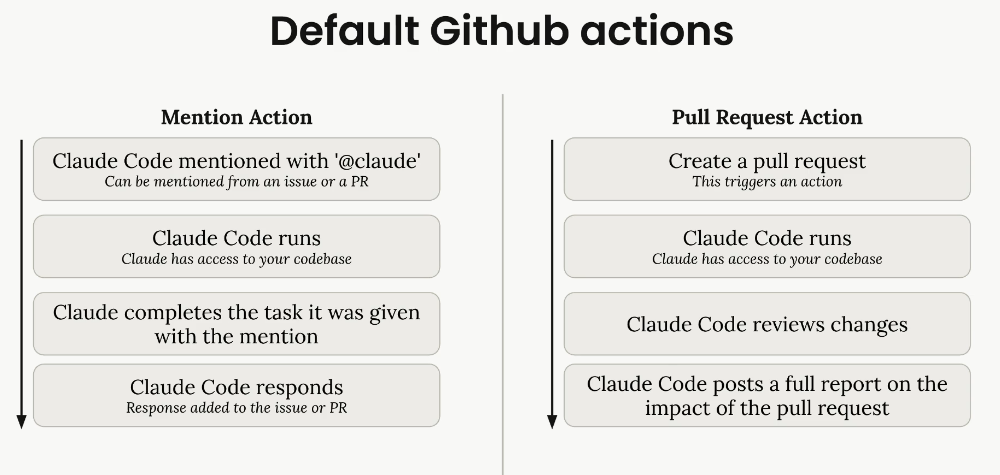

# [Integrating Claude Code with GitHub](https://code.claude.com/docs/en/github-actions)

Claude Code GitHub Actions brings AI-powered automation to your GitHub workflow.  
With a simple `@claude` mention in any PR or issue, Claude can analyze your code, create pull requests, implement features, and fix bugs - all while following your project’s standards.

## Setup

Open claude and run `/install-github-app`  
This command will guide you through setting up the GitHub app and required secrets.

## Default GitHub Actions Workflows

Claude Code GitHub Actions supports these two default workflows:
1. **Pull Request Action:** 
Whenever you create a pull request, Claude automatically:
    - Reviews the proposed changes
    - Analyzes the impact of modifications
    - Posts a detailed report on the pull request

2. **Mention Action**
You can mention Claude in any issue or pull request using `@claude`. 
When mentioned, Claude will:
    - Analyze the request and create a task plan
    - Execute the task with full access to your codebase
    - Respond with results directly in the issue or PR
Claude will respond directly in the thread with its analysis or changes.

Examples:
- `@claude` implement this feature based on the issue description.
- `@claude` how should I implement user authentication for this endpoint?
- `@claude` fix the TypeError in the user dashboard component.

## [Customizing the Workflows](https://anthropic.skilljar.com/claude-code-in-action/303240)

After merging the initial pull request, you can customize the workflow files to fit your project's needs.

## Important Note

To ensure Claude is provided with the necessary project context, the repository root must include `CLAUDE.md`.
