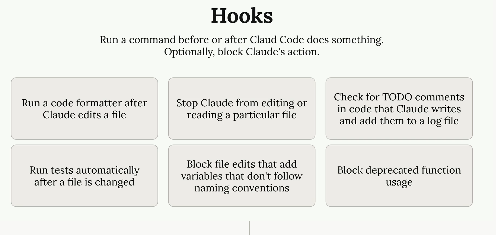
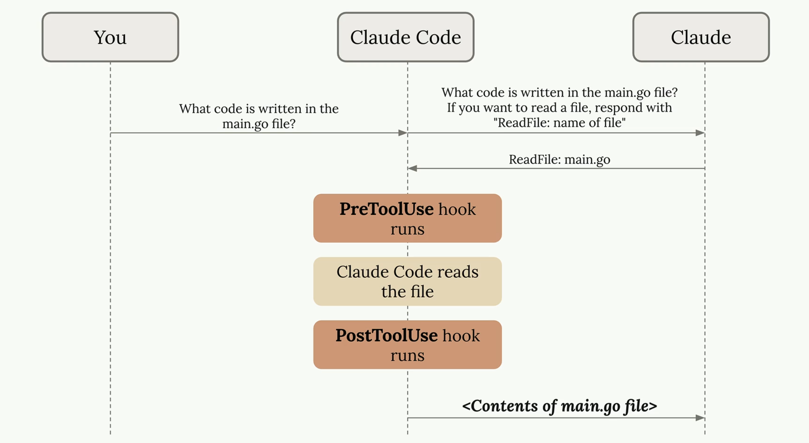
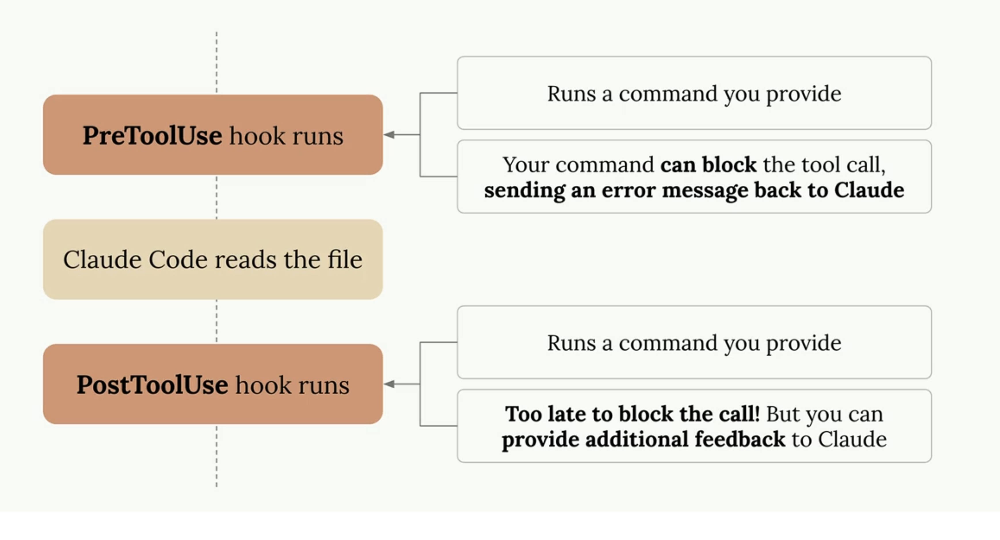

# [Hooks](https://code.claude.com/docs/en/hooks-guide)

Hooks allow you to run commands before or after Claude attempts to run a tool. 

## How Hooks Work

Hooks insert themselves into this process, allowing you to execute code just before or just after the tool execution happens.

- **PreToolUse hooks** - Run before a tool is called
- **PostToolUse hooks** - Run after a tool is called

## Hook Configuration

Hooks are defined in Claude settings files. You can add them to:

- Global - `~/.claude/settings.json` (affects all projects)
- Project - `.claude/settings.json` (shared with team)
- Project (not committed) - `.claude/settings.local.json` (personal settings)

## [Examples for Useful Hooks](https://anthropic.skilljar.com/claude-code-in-action/312004)

- TypeScript type checking hook
- Query duplication prevention hook

## [Additional Examples](https://anthropic.skilljar.com/claude-code-in-action/312427)

## Example - Notification Hook

**event-based hooks** within the Claude Code CLI.  
This project automates audio feedback loops specifically triggered by Claude's lifecycle events.

### Prompt to generate the Python code:
*Write a python script that is going to play the sound @notification.wav  every time the  script runs.*
