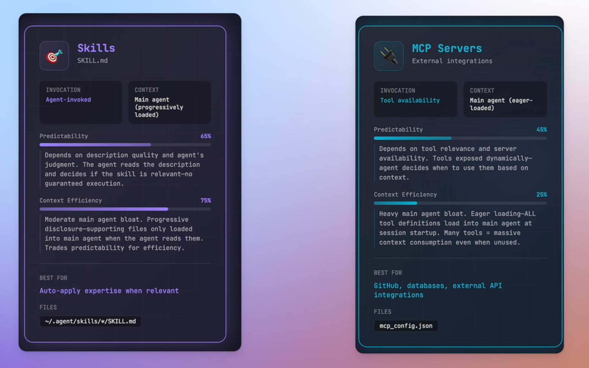
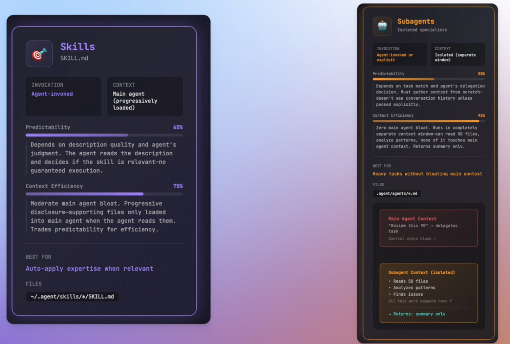

# [Agent Skills](https://code.claude.com/docs/en/skills) - Extend Claude’s capabilities

https://agentskills.io/home <br />
[Skills announcement](https://www.anthropic.com/engineering/equipping-agents-for-the-real-world-with-agent-skills)

***Instructions that extend Claude's knowledge.*** <br />
Skills are modular, reusable knowledge packages (like folders with instructions and code) that provide Claude with specialized expertise, allowing it to autonomously learn and apply domain-specific workflows, best practices, and tools for complex coding tasks, reducing repetitive prompting and transforming general agents into specialists. <br />
These skills are dynamically loaded on-demand, enhancing Claude's capabilities for tasks like data analysis, file processing, or adhering to coding standards.

Claude Skills are like a more advanced, modular **system prompt**, allowing you to package domain-specific knowledge, workflows, and best practices into reusable components (Markdown files) that Claude loads on-demand, reducing bloat and repetition compared to stuffing everything into one large, static system prompt.

Claude skills are primarily **loaded dynamically**. They use a mechanism called "progressive disclosure" to optimize context window usage and ensure efficiency.
I.e., Skills are designed for **maximum context efficiency**:
- **Initial Load**: On session start, only the high-level summary (description section) is loaded.
- **Deferred Loading**: The agent dynamically pulls the complete instruction set only if it identifies the skill as necessary for the current task.
- **Benefit**: We avoid "context bloat" by ignoring irrelevant skill details until they are needed.

## Third-Party Skills

[Claude Skills Marketplace](https://github.com/mhattingpete/claude-skills-marketplace/tree/main) <br />
[Anthropic - Public Inventory for Skills](https://github.com/anthropics/skills) <br />
[Vercel - Open Agent Skills Ecosystem](https://skills.sh/) <br />
[GitHub - sickn33/antigravity-awesome-skills](https://github.com/sickn33/antigravity-awesome-skills)


## Installing Skills from the Marketplace

Before installing/creating a Skill, see what Skills Claude already has access to with: ```What Skills are available?```

Here are the steps for installation:

1) Clone the marketplace repository into `~/.claude/plugins/marketplaces/`:

```
/plugin marketplace add anthropics/skills
```

2) Browse and install skills

```
/plugin
```

## [Custom Skill](https://code.claude.com/docs/en/skills#create-your-first-skill)

1) Create a new folder in `~/.claude/skills/` with your skill name.
2) Add a `SKILL.md` file with your skill instructions.
3) (Optional) Add additional files or folders as needed for your skill.
4) Skills are automatically loaded when created or modified. <br />Verify the Skill appears in the list with: `What Skills are available?`

## Skill Folder Structure
A Skill is a folder containing a `SKILL.md` file with instructions for Claude. <br />
Additional folders/files can be included as needed.

```
~/.claude/skills/
  └── your-skill-name/
      ├── SKILL.md            # Required: main instructions
      ├── extra .md documents # Optional: additional documentation for the skill
      ├── scripts/            # Optional: Executable code to automate tasks (Python, Bash, Node, etc.)
      ├── references/         # Optional: Documents, markdown files, or notes used as context
      └── assets/             # Optional: Templates, images, diagrams
```

## SKILL.md

SKILL.md file contains the main instructions for the Skill. It should include:
- A clear and brief description of the Skill's purpose.
- Step-by-step instructions for Claude to follow.
- Any relevant examples or best practices.

### Notes:
- `disable-model-invocation: true` - Prevents Claude from invoking this Skill., i.e. if we want to use the Skill as a **custom command** only.
- `user-invocable: false` - Automatic discoverability, NO user invocation with custom slash command.
- `allowed-tools` - List of [tools](https://code.claude.com/docs/en/settings#tools-available-to-claude) that are allowed to be used by the Skill.
- `$ARGUMENTS` - placeholder for argument(s) passed to the Skill.

### Additional Files

Additional files can be included to support the Skill's functionality, such as scripts, data files, or configuration files.

## [When to use Skills versus other options](https://code.claude.com/docs/en/skills#when-to-use-skills-versus-other-options )

### Skills vs. MCP

- MCP provides the tools; Skills tell Claude how to use tools.
- E.g., an MCP server connects Claude to your database, while a Skill teaches Claude your data model and query patterns.
- MCP connects the agent to external data, while Skills empower the agent to perform specialized tasks.
- Unlike the tiered loading of Skills, MCP requires upfront provisioning of all tool definitions and server specifications at the session start, making it less context-efficient for large toolsets.
- The agent determines which to invoke based on the task. MCP executes on remote servers, whereas Skills run locally within the agent’s environment (main agent thread).



### [Skills vs. Subagents](https://dev.to/nunc/claude-code-skills-vs-subagents-when-to-use-what-4d12)

- **Context**: Skills add to the main context; Subagents create new, isolated contexts.
- Claude Code spawns subagents ("specialized coworker") to handle modular tasks within complex workflows.
- Use Skills for guidance and standards within the current context; use subagents to isolate complex tasks or when a different set of tools is required.


