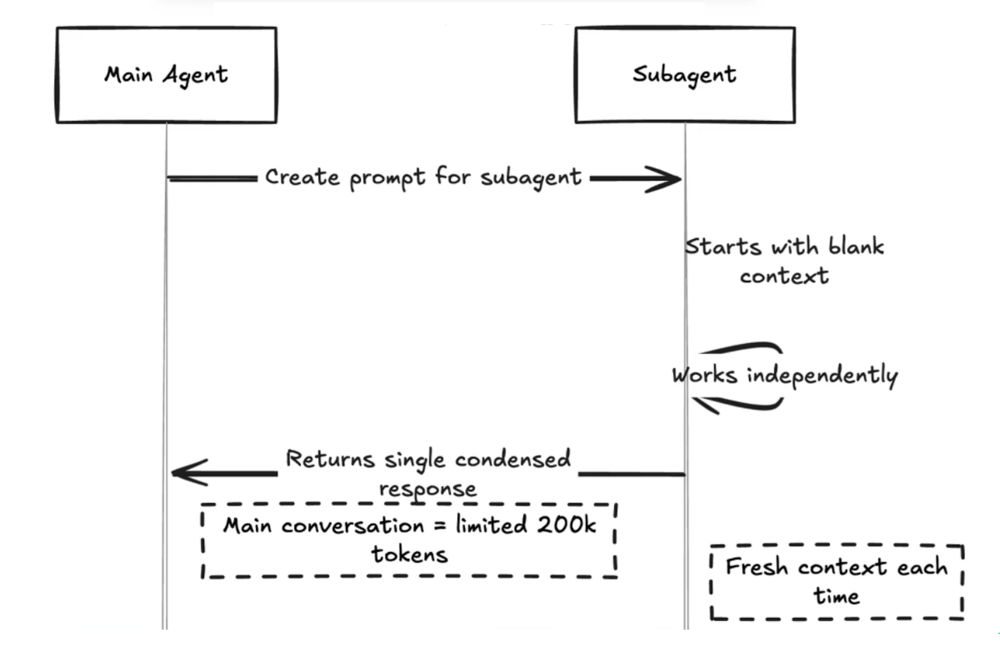

# [Subagents](https://code.claude.com/docs/en/sub-agents)

These are specialized AI assistants that handle specific types of tasks. <br />
Each subagent runs in its own context window with a custom system prompt, specific tool access, and independent permissions. When Claude encounters a task that matches a subagent’s description, it delegates to that subagent, which works independently and returns results.

## Quickstart - create our own subagent

1) Subagents are defined in Markdown files with YAML frontmatter. <br />
   We can create them manually or use the `/agents` slash command.

2) Select **Create new agent**, then choose either *User-level* or *Project-level*.

3) Select **Generate with Claude** (recommended). <br />
   We can use *Claude* or *Gemini* for example, to enhance the prompt. <br />
   It is important to include an *Activation Trigger* section.

4) [**Select tools**](https://code.claude.com/docs/en/settings#tools-available-to-claude)

5) **Select model**

6) **Choose a color** (background color for the subagent)

## Context Flow
When a subagent is invoked, it operates in its own context window. <br />
This means, that its token consumption is excluded from the main thread's total quota. <br />
A compact summary is integrated back into the main thread upon task completion, ensuring that the primary context window is spared from unnecessary token bloat.



## Examples:

- **UX/UI Reviewer**
```script
Expert UX&UI engineer who reviews the UX&UI of React components in a browser using Playwright, takes screenshots, then offers feedback on how to improve the component in terms of visual design, user experience and accessibility.
```
