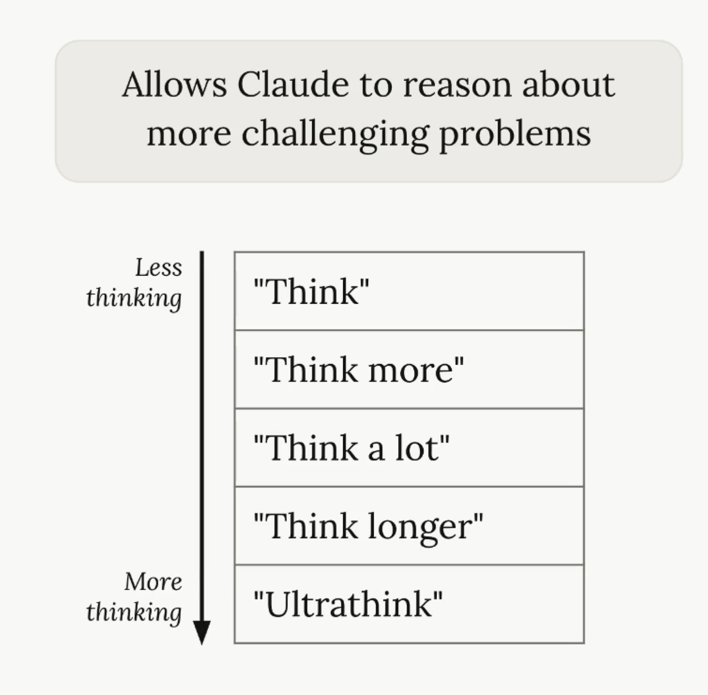

# Thinking Modes

Claude Code thinking modes allow the AI to reason through complex programming tasks, planning and analyzing before generating code.<br/>
Activated by various keywords like "think" or "ultrathink," these modes provide varying levels of token-based reasoning depth to enhance accuracy in complex software engineering scenarios. 

## Usage

We can use the following to guide Claude:

```script
This is a tough task, so ultrathink about the best way to implement it.
```


